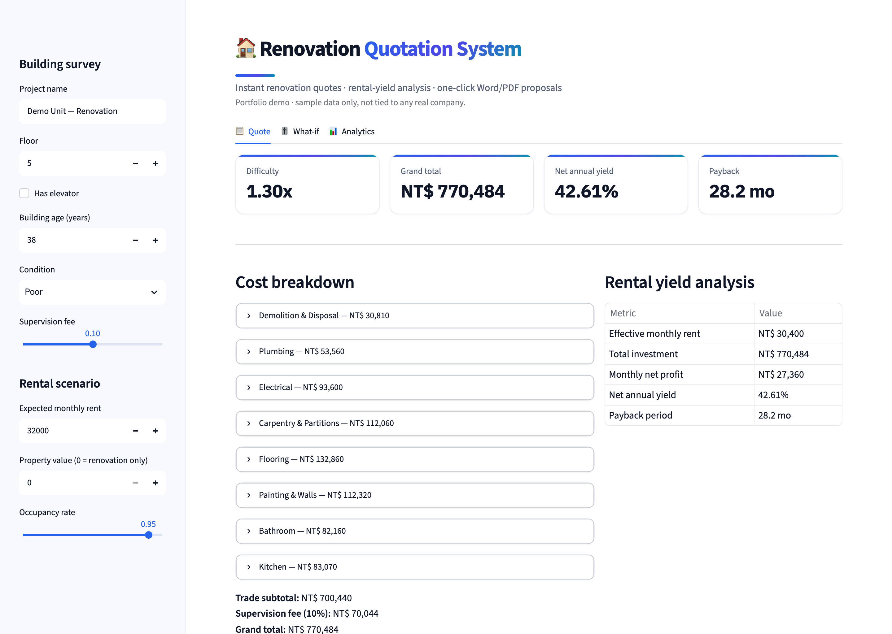
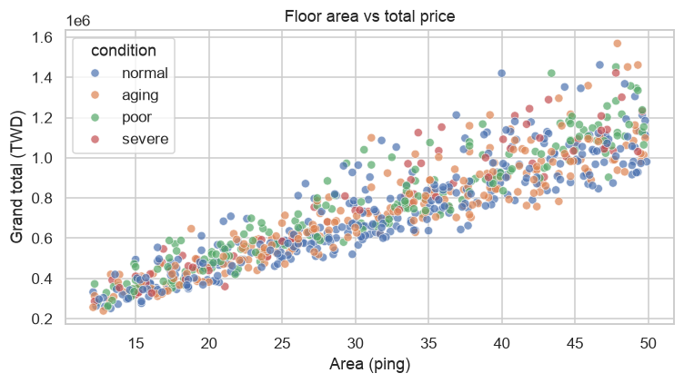
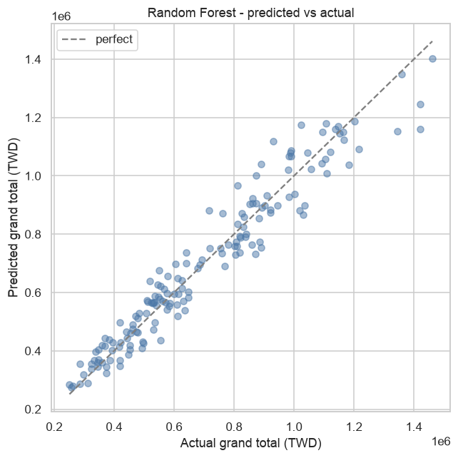
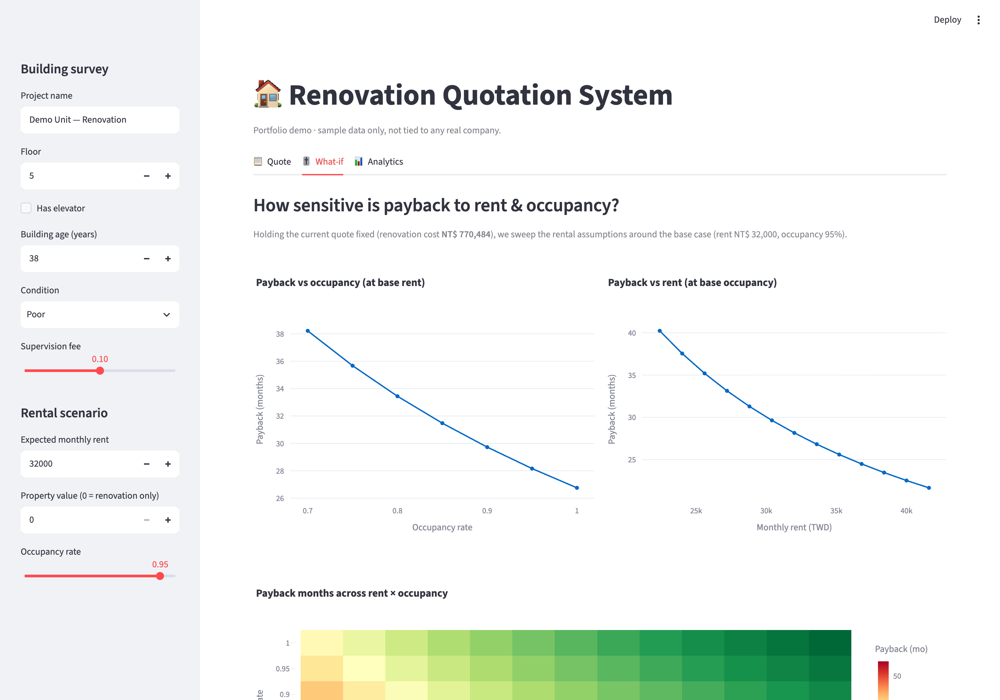
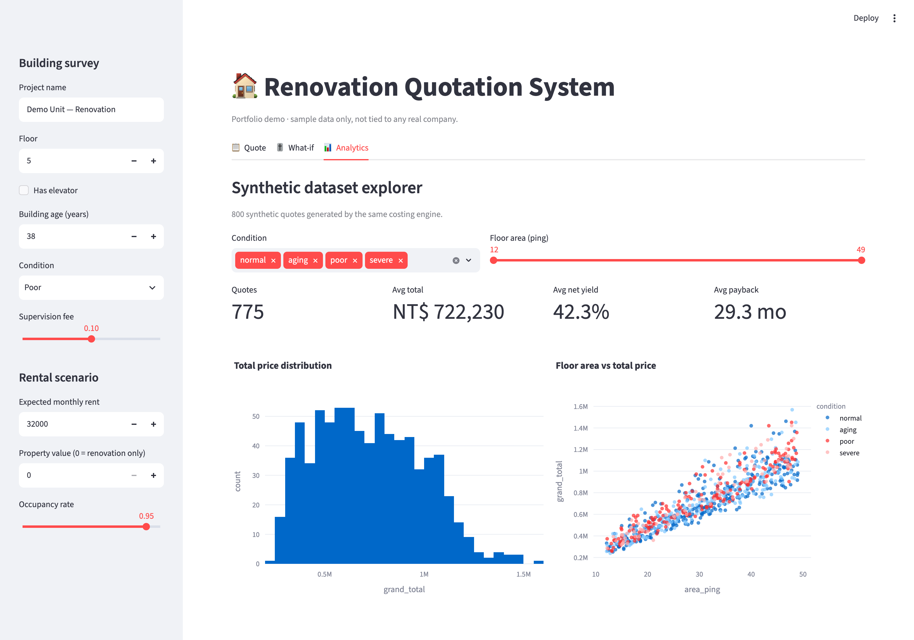
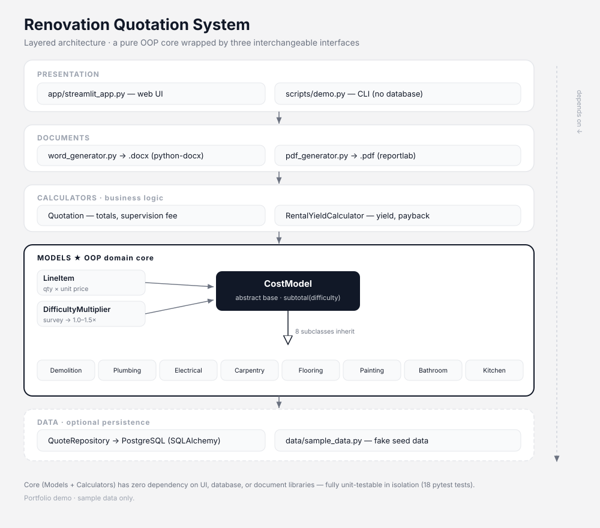
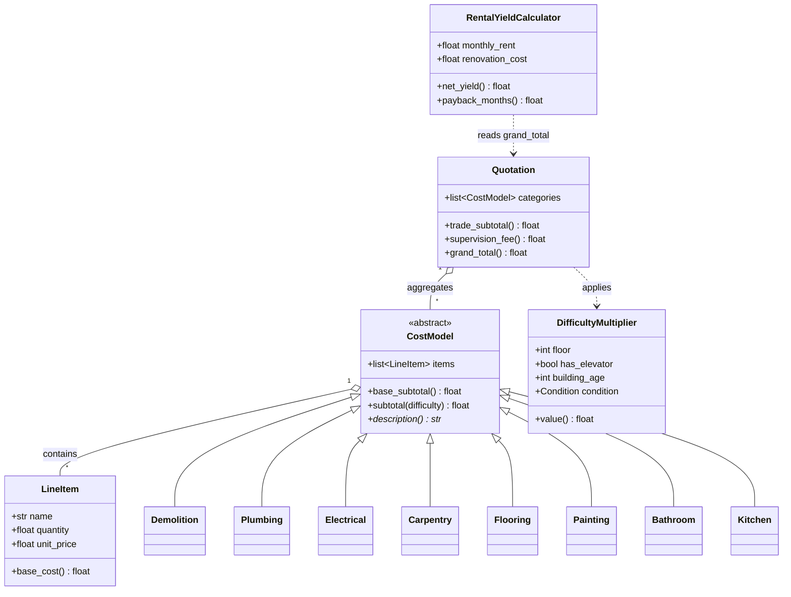

# Renovation Quotation System

[](https://github.com/wayneliu0297/renovation-quotation-system/actions/workflows/ci.yml)


A portfolio project demonstrating an object-oriented cost-estimation engine for
home-renovation projects, with a rental-yield calculator, automatic Word/PDF
proposal generation, a Streamlit web UI, and a PostgreSQL backend.

> **Demo / portfolio only.** All data is fake and not tied to any real company.



## Features

- **OOP cost engine** — an abstract `CostModel` base class with 8 renovation
  category subclasses (painting, plumbing, electrical, flooring, carpentry,
  bathroom, kitchen, demolition). Each category holds line items with a
  quantity and unit price.
- **Dynamic difficulty multiplier (1.0×–1.5×)** derived from building age,
  floor level, elevator availability, and structural condition.
- **Rental-yield calculator** — gross/net yield, monthly profit and payback
  period for a buy-to-rent scenario.
- **Document generation** — one-click `.docx` and `.pdf` proposals.
- **Streamlit UI** — fill in a survey form, get an instant quote.
- **PostgreSQL persistence** — save quotes and retrieve them later
  (via SQLAlchemy).
- **Data-science track** — a synthetic dataset + notebook with EDA and a
  price-prediction model (see below).

## Data science: EDA & cost prediction

Beyond the rule-based engine, the repo includes a small data-analysis track: a
synthetic dataset of **800 quotes** (generated by the same OOP engine, so the
app and the analysis share one source of truth) and a notebook that explores it
and trains models to **predict the final price** from a quick building survey.

📓 **[notebooks/quotation_analysis.ipynb](notebooks/quotation_analysis.ipynb)** — the full EDA + modeling walk-through (renders on GitHub).

<p align="center">
  
  
</p>

**Model results** — 20% hold-out test set, target = `grand_total`:

| Model | MAE | RMSE | R² |
| --- | ---: | ---: | ---: |
| Linear Regression | NT$ 60,855 | NT$ 78,401 | 0.922 |
| Random Forest | NT$ 54,340 | NT$ 71,014 | **0.936** |

The Random Forest predicts the quote to within ~7% (MAE) using only area, floor,
elevator, building age and condition — and the exercise doubles as a discussion
of **rule engine vs learned model** (transparent-but-fixed vs flexible-but-opaque).

Reproduce:

```bash
pip install -r requirements-analysis.txt
python -m scripts.generate_dataset        # -> data/quotes_sample.csv
jupyter notebook notebooks/quotation_analysis.ipynb
```

### Interactive app tabs

The Streamlit app has three tabs — a live **Quote**, a **What-if** sensitivity
view (how payback reacts to rent & occupancy), and an **Analytics** dashboard
over the synthetic dataset (interactive Plotly charts with filters):

<p align="center">
  
  
</p>

## Architecture

A pure object-oriented core (`models` + `calculators`) wrapped by three
interchangeable interfaces (CLI, web UI, database). The core has **zero**
dependency on Streamlit, PostgreSQL or the document libraries, so it is fully
unit-testable in isolation.



### Domain model



### Source layout

```
src/renovation_quote/
├── models/            # OOP domain layer
│   ├── line_item.py       # LineItem value object
│   ├── cost_model.py      # abstract CostModel base class
│   ├── categories.py      # 8 concrete category subclasses
│   └── difficulty.py      # DifficultyMultiplier
├── calculators/       # business logic
│   ├── quotation.py       # Quotation aggregate (totals, supervision fee)
│   └── rental_yield.py    # RentalYieldCalculator
├── db/                # persistence (SQLAlchemy + PostgreSQL)
│   ├── database.py        # engine / session factory
│   ├── schema.py          # ORM tables
│   └── repository.py      # save / load quotes
├── documents/         # output generation
│   ├── word_generator.py
│   └── pdf_generator.py
└── data/
    ├── sample_data.py     # fake seed data for the app
    └── synthetic.py       # synthetic dataset generator for analysis

notebooks/quotation_analysis.ipynb   # EDA + cost-prediction model
data/quotes_sample.csv               # generated dataset (800 rows)
```

## Quick start

```bash
# 1. Create a virtual environment
python3 -m venv .venv
source .venv/bin/activate

# 2. Install dependencies
pip install -r requirements.txt

# 3. Try the engine without any database or UI
python -m scripts.demo

# 4. (Optional) start PostgreSQL and seed it
cp .env.example .env          # edit DATABASE_URL if needed
python -m scripts.seed_db

# 5. Launch the web UI
streamlit run app/streamlit_app.py

# 6. (Optional) run the data-science track
pip install -r requirements-analysis.txt
python -m scripts.generate_dataset        # -> data/quotes_sample.csv
jupyter notebook notebooks/quotation_analysis.ipynb
```

## Difficulty multiplier

```
multiplier = 1.0
           + floor_factor       # no elevator & floor >= 4: (floor-3) * 0.05
           + age_factor         # building age > 30 years: +0.10
           + condition_factor   # normal 0 / aging +0.05 / poor +0.10 / severe +0.15
multiplier = clamp(multiplier, 1.0, 1.5)
```

## Tech stack

**App:** Python 3.12 · SQLAlchemy · python-docx · reportlab · Streamlit · PostgreSQL
**Analysis:** pandas · NumPy · scikit-learn · matplotlib · seaborn · Jupyter
